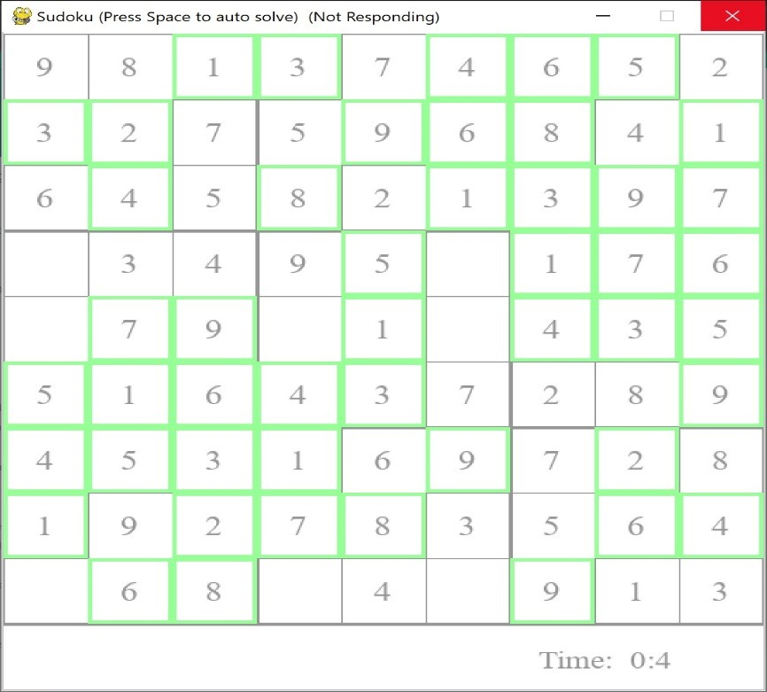

# Sudoku Solver GUI

This is a graphical user interface (GUI) Sudoku solver built using Python and Pygame. The application allows users to manually solve a Sudoku puzzle or let the program solve it using a backtracking algorithm.

## Features

- **Interactive Sudoku board**: Users can click on cells to select and input numbers.
- **Automated solving**: The application can solve the Sudoku puzzle using the space bar to trigger the backtracking algorithm.
- **Sketching**: Users can input tentative numbers (pencil marks) to help solve the puzzle manually.
- **Error tracking**: Wrong guesses are counted as strikes.
- **Visual feedback**: During automated solving, the grid updates in real-time to show the algorithm's progress.

## Getting Started

### Prerequisites

To run the project, you'll need to install Python (3.6 or later) and Pygame:

```bash
pip install pygame
```
## Running the Application

1. Clone this repository:

```bash
git clone https://github.com/your-username/sudoku-solver-gui.git
cd sudoku-solver-gui
```
2. Run the application

```bash
python guiapp.py
```



## Controls

- **Mouse Click**: Select a cell.
- **Number Keys (1-9)**: Place a number in the selected cell.
- **Delete Key**: Clear the current selected cell (if it's empty).
- **Space Bar**: Trigger the automated solving using the backtracking algorithm.
- **Enter Key**: Confirm the sketched number (pencil mark) as the final answer.

## Solving Algorithm

The solving algorithm uses a **backtracking approach** to fill in the empty spaces with valid numbers. The algorithm checks each possibility and backtracks if an invalid number is placed. The `solve_gui()` method provides a visual representation of the backtracking process.

## Project Structure

```plaintext
.
├── guiapp.py          # Main Pygame application file
├── README.md          # Project documentation
└── requirements.txt   # Project dependencies (optional)
```

## Dependencies

- **Pygame** - The library used to create the GUI for the Sudoku solver.

To install dependencies, you can run:

```bash
pip install -r requirements.txt
```

## Future Improvements

- **Load Custom Sudoku Puzzles**: Add a feature allowing users to load their own Sudoku puzzles into the application.
- **Difficulty Selector**: Implement a feature to select puzzle difficulty levels (easy, medium, hard).
- **Timer**: Add a timer to track the player's solving speed and provide feedback on performance.

## License

This project is licensed under the MIT License - see the [LICENSE](LICENSE) file for details.

## Acknowledgments

- The backtracking algorithm used in the solver is inspired by various Sudoku-solving algorithms available online.
- Thanks to the **Pygame Documentation** for providing excellent support in building game UIs.
